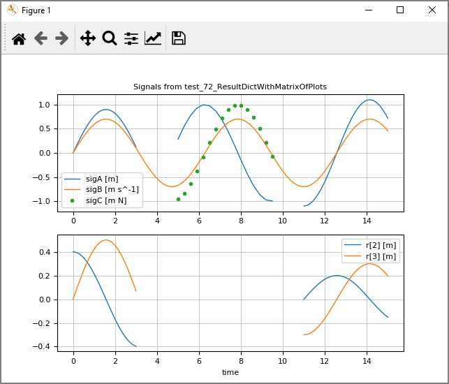

# SignalTablesInterface_PyPlot

SignalTablesInterface_PyPlot is part of [ModiaSim](https://modiasim.github.io/docs/)
and provides convenient line plots of simulation results with package
[PyPlot](https://github.com/JuliaPy/PyPlot.jl) (= a
Julia interface to the [Matplotlib](http://matplotlib.org/) plotting library 
from Python, and specifically to the `matplotlib.pyplot` module).

SignalTablesInterface_PyPlot is typically not directly used, but is activated via package
[SignalTables](https://github.com/ModiaSim/SignalTables.jl).
For details of the installation and the usage, 
see the [SignalTables documentation](https://modiasim.github.io/SignalTables.jl/stable/index.html).


## Example

Once a signal table `sigTable` with signals `sigA(t), sigB(t), sigC(t), r[3](t)`:
is available and `PyPlot` selected for plotting, 

```julia
using SignalTables

usePlotPackage("PyPlot")                
@usingModiaPlot   # = using SignalTablesInterface_PyPlot
```

then the following command

```julia
plot(result, [("sigA", "sigB", "sigC"), "r[2:3]"])
```

generates the following image (layout and legends are automatically constructed):




## Main developer

[Martin Otter](https://rmc.dlr.de/sr/en/staff/martin.otter/),
[DLR - Institute of System Dynamics and Control](https://www.dlr.de/sr/en)
